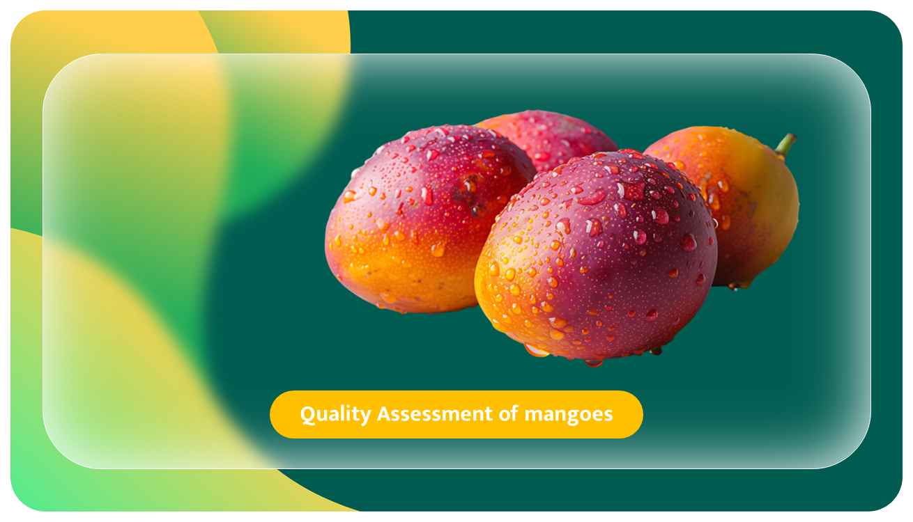
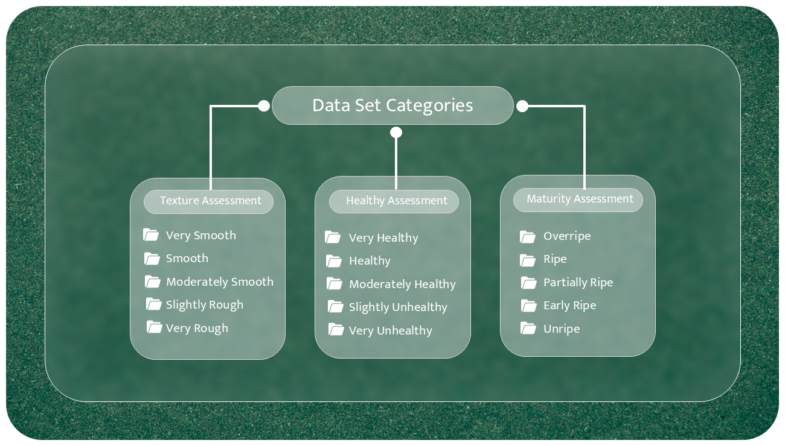
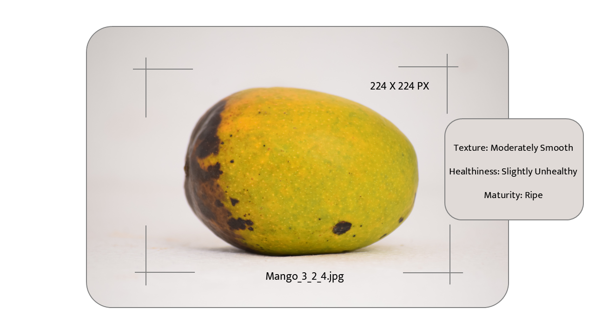
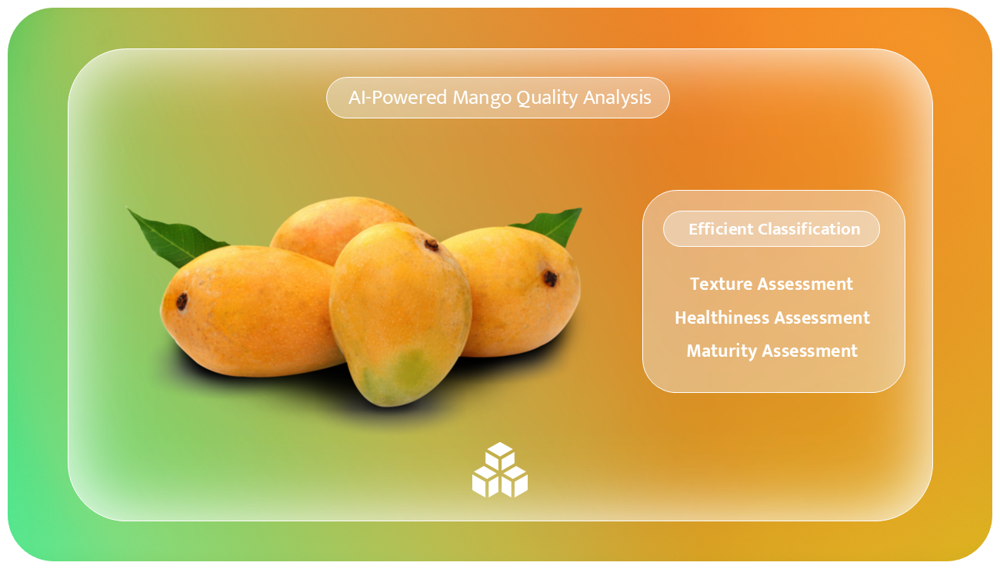

<h3 align="center">Integrated System for Quality Assessment Based on Texture, Health, and Ripeness Evaluation for Mangoes</h3>

  

## 🔍 **Project Overview**  

🚀 **AI-Powered Mango Quality Assessment System**  
This project introduces an **automated AI-driven solution** for evaluating mango quality based on **texture, health, and ripeness**.  
By leveraging **image processing** and **deep learning techniques**, the system classifies mangoes into different quality categories, ensuring better sorting and decision-making in the agricultural and food industries.  

### 🔬 **Key Features**  
- **🟢 Texture Analysis:** Determines the smoothness or roughness of mango skin.  
- **🍅 Health Condition:** Identifies potential defects, bruises, or diseases.  
- **🥭 Ripeness Level:** Classifies mangoes as unripe, ripe, or overripe.  

### 🤖 **Technologies Used**  
- **📸 Image Processing** for feature extraction.  
- **SVM & KNN Algorithms** for classification.  
- **Data Preprocessing & Augmentation** to improve model accuracy.  

✅ This system enables **efficient quality control, reduces human error**, and enhances **agricultural decision-making** by automating the mango grading process. 🍃

## 📂 Dataset Description  
The dataset used in this project consists of **mango images** collected from publicly available sources. Each mango sample is assessed based on three key parameters: **Texture, Healthiness, and Maturity**, using a **Likert scale (1 to 5)**.  

  

## 📊 Data Labeling and Annotation  
Each mango image in the dataset is labeled based on the following assessment criteria:  

### **1️⃣ Texture Assessment**  
📌 **Likert Scale (1 to 5):**  
🔵 **1 – Very Smooth** 🟢  
🟢 **2 – Smooth**  
🟡 **3 – Moderately Smooth**  
🟠 **4 – Slightly Rough**  
🔴 **5 – Very Rough**  

___

### **2️⃣ Healthiness Assessment**  
📌 **Likert Scale (1 to 5):**  
🟢 **1 – Very Healthy** ✅  
🟢 **2 – Healthy**  
🟡 **3 – Moderately Healthy**  
🟠 **4 – Slightly Unhealthy**  
🔴 **5 – Very Unhealthy** ❌  

---

### **3️⃣ Maturity Assessment**  
📌 **Likert Scale (1 to 5):**  
🔴 **1 – Overripe** 🍂  
🟠 **2 – Ripe** 🥭  
🟡 **3 – Partially Ripe**  
🟢 **4 – Early Ripe**  
🔵 **5 – Unripe** 🌱  

---

### ✂️ Preprocessing  
- **Resizing** (e.g., **224×224 pixels**).  
- **Color Normalization** for uniformity.  
- **Noise Reduction** to remove distortions.  
- **Data Augmentation** (rotation, flipping, scaling).  

### 🔄 Splitting the Dataset  
- **70%** – Training Set  
- **15%** – Validation Set  
- **15%** – Test Set  

### 🏗️ Feature Extraction  
Extracting **texture, color distribution, and edges** to enhance model learning.  

  

### 🛠️ Model Input Preparation  
Images are converted into **numerical matrices**, normalized (0-1 range), and prepped for deep learning models.  

✅ **Final Output:** A clean, structured dataset ready for training.  

### 🧠 Machine Learning Models  

### **1️⃣ Support Vector Machine (SVM) ⚡**  
- Finds the optimal decision boundary for classification.  
- Works well with high-dimensional data and texture-based features.  

### **2️⃣ K-Nearest Neighbors (KNN) 🔍**  
- Classifies based on similarity to neighbors.  
- Simple, effective, and works best with well-separated clusters.  

---

### 📊 Model Evaluation  
Models were trained and evaluated using:  
✅ **Accuracy** | ✅ **Precision & Recall** | ✅ **Confusion Matrix**  

📌 **Hyperparameter tuning** was performed to enhance performance.  

  

### ✅ Conclusion  
SVM and KNN were tested for mango classification. The best-performing model was selected for final deployment, ensuring accurate texture, healthiness, and maturity assessment.  

✅ **Final Outcome:** A fully functional AI-powered system for automated mango quality assessment.  

